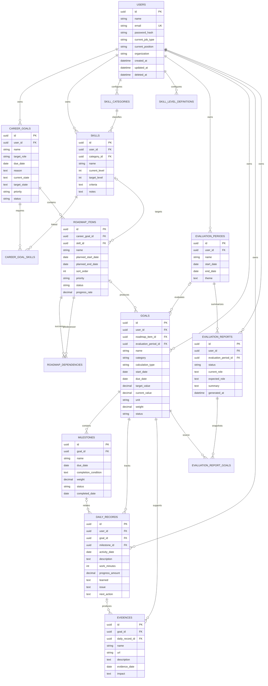

# ER 図

## 論理 ER 図

## 補助エンティティ

| エンティティ              | 主な役割・制約                                                                         |
| ------------------------- | -------------------------------------------------------------------------------------- |
| `CAREER_GOAL_SKILLS`      | `career_goal_id` と `skill_id` の複合一意制約を持つ。                                  |
| `SKILL_CATEGORIES`        | ユーザー別の名称、表示順、有効フラグを持つ。                                           |
| `SKILL_LEVEL_DEFINITIONS` | ユーザー別にレベル 1～5 の名称・説明を持つ。`user_id, level` を一意にする。            |
| `ROADMAP_DEPENDENCIES`    | 後続項目と前提項目を保持する。同一項目の指定と循環参照を禁止する。                     |
| `EVALUATION_REPORT_GOALS` | 作成時点の目標名、達成率、実績、成果、未達、振り返りをスナップショットとして保持する。 |

## 設計ルール

- UUID を外部公開 ID として利用する。
- ユーザー所有データには、直接または親を介して必ず所有ユーザーを特定できる関連を持たせる。
- 認可では URL の ID だけを信用せず、所有ユーザー条件を含めて取得する。
- 削除対象の主要テーブルには `created_at`、`updated_at`、`deleted_at` を持たせる。
- ステータス、分類、計算方式はアプリケーションで列挙値を検証する。
- 達成率は算出値を正とする。キャッシュする場合も、再計算可能な元データを保持する。
- 証跡に日次実績を指定した場合、その日次実績が同じ目標に属することを検証する。
- 評価資料は後日の元データ変更に影響されないよう、目標別結果をスナップショット保存する。

## 物理設計時に追加する主なインデックス

- `users(email)` 一意
- `career_goals(user_id, status, due_date)`
- `skills(user_id, category_id, name)` 一意
- `roadmap_items(career_goal_id, planned_start_date, sort_order)`
- `goals(user_id, status, due_date)`
- `daily_records(user_id, activity_date)`
- `daily_records(goal_id, activity_date)`
- `evidences(goal_id)`
- `evaluation_periods(user_id, start_date, end_date)`
