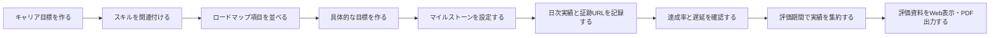

# MVP スコープ

## プロダクトゴール

IT エンジニアが、キャリア目標から日々の行動と成果までを一続きで記録し、評価期間を指定して説明可能な人事評価資料を作成できるようにする。

## 主要ユーザーストーリー

1. 利用者として、目指す役割と必要なスキルを整理したい。
2. 利用者として、ロードマップから測定可能な目標を作りたい。
3. 利用者として、日々の行動・成果・学びを短時間で記録したい。
4. 利用者として、期限と予定に対する遅れを把握したい。
5. 利用者として、実績と証跡を評価期間単位でまとめたい。
6. 利用者として、評価資料を Web と PDF で確認・共有したい。

## MVP の業務フロー

## MVP 対象範囲

| 領域         | MVP に含む                                           | MVP では含まない                      |
| ------------ | ---------------------------------------------------- | ------------------------------------- |
| 認証         | メールアドレスとパスワードによるログイン、ログアウト | SSO、多要素認証、上司・人事ロール     |
| キャリア     | キャリア目標の CRUD、スキル関連付け                  | AI による提案、組織標準キャリアパス   |
| スキル       | スキルの CRUD、分類、現在・目標レベル                | 組織横断比較、スキル承認              |
| ロードマップ | 一覧・時系列表示、項目 CRUD、依存関係                | 高機能カンバン、ドラッグ操作          |
| 目標         | CRUD、SMART 警告、マイルストーン、達成率             | 上司承認、報酬連携                    |
| 日次実績     | CRUD、カレンダー表示、証跡 URL                       | 添付ファイル、外部サービス自動取込    |
| 可視化       | KPI、目標進捗、期限警告、活動時間                    | 高度な分析、ユーザー間比較            |
| 評価資料     | 期間集約、編集、Web、印刷、PDF                       | PowerPoint、Excel、会社別テンプレート |
| 設定         | 評価期間、スキル分類、レベル定義                     | 複雑な権限・ワークフロー設定          |

## 業務ルール

| ID    | ルール                                                                                                                                      |
| ----- | ------------------------------------------------------------------------------------------------------------------------------------------- |
| BR-01 | すべての業務データは所有ユーザーに紐付き、他ユーザーから参照できない。                                                                      |
| BR-02 | スキルレベルは 1～5 とし、名称・説明はユーザーが変更できる。                                                                                |
| BR-03 | 目標は数値型、マイルストーン型、習慣型、手動評価型のいずれかの計算方式を持つ。                                                              |
| BR-04 | 数値型は `現在値 ÷ 目標値 × 100` で計算する。目標値は 0 より大きくする。                                                                    |
| BR-05 | マイルストーン型は完了した項目の重み合計を全項目の重み合計で除して計算する。                                                                |
| BR-06 | 習慣型は期間内の実施日数を計画日数で除して計算する。                                                                                        |
| BR-07 | 手動評価型は進捗率と判断理由を必須にする。                                                                                                  |
| BR-08 | 表示達成率は最大 100% とし、超過率を別に表示する。                                                                                          |
| BR-09 | 予定進捗との差が 10 ポイント以上なら「注意」、25 ポイント以上または期限超過なら「遅延」とする。達成条件を満たした場合は「達成」を優先する。 |
| BR-10 | 日次実績の作業時間は分単位で保持し、0～1,440 分の範囲とする。                                                                               |
| BR-11 | 証跡 URL は目標または日次実績に関連付ける。                                                                                                 |
| BR-12 | 評価資料は生成時点の集約結果を下書きとして保存し、利用者が追記・修正できる。                                                                |

## 非機能要件

| ID     | 要件             | MVP の検証基準                                                                                      |
| ------ | ---------------- | --------------------------------------------------------------------------------------------------- |
| NFR-01 | 操作性           | 日次実績を標準ケースで 3 分以内、主要機能を 3 クリック以内で開始できる。                            |
| NFR-02 | レスポンシブ     | 幅 375px 以上のスマートフォンと一般的な PC で主要操作ができる。                                     |
| NFR-03 | 性能             | 通常画面 3 秒以内、ダッシュボード 5 秒以内、PDF 30 秒以内を p95 の目標とする。                      |
| NFR-04 | セキュリティ     | パスワードを強固なハッシュで保存し、認可をサーバー側で検証する。通信は本番環境で TLS を必須にする。 |
| NFR-05 | ログ             | 認証失敗と重要操作を記録するが、パスワード・本文・評価内容を出力しない。                            |
| NFR-06 | 復元性           | 更新日時と削除日時を保持し、削除データを一定期間復元可能にする。                                    |
| NFR-07 | アクセシビリティ | 状態を色だけで表さず、文言またはアイコンを併記する。キーボード操作とラベル付けに対応する。          |

## MVP 完了条件

- 要件定義の「10. 受入条件」を満たす E2E シナリオが成功する。
- ユーザー A のデータをユーザー B が取得・更新できないことを自動テストで確認する。
- 主要な達成率方式と期限判定を単体テストで確認する。
- PC とスマートフォン幅で主要画面の表示崩れがない。
- 指定期間の評価資料が Web と PDF で同じ主要情報を含む。

## 未決事項

| ID   | 論点                                             | MVP の暫定判断                                                    |
| ---- | ------------------------------------------------ | ----------------------------------------------------------------- |
| Q-01 | 新規ユーザー登録を公開するか                     | 開発用の登録画面を用意し、本番公開可否は運用設計時に決める。      |
| Q-02 | PDF の正式レイアウト                             | A4 縦、表紙なし、目標ごとに結果を表示する標準テンプレートとする。 |
| Q-03 | 自動保存の対象                                   | 日次入力と評価資料編集を対象にし、他の登録画面は明示保存とする。  |
| Q-04 | 削除データの保持期間                             | 30 日を暫定値とする。                                             |
| Q-05 | 目標の「タスク完了型」と「マイルストーン型」の差 | MVP ではマイルストーン型へ統合する。                              |
