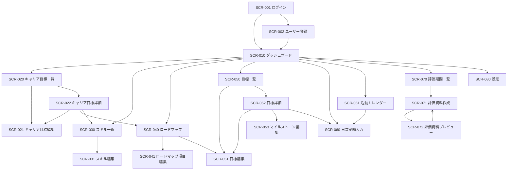

# 画面遷移図

## 画面一覧

| ID      | 画面名               | 主な目的                                   | MVP                    |
| ------- | -------------------- | ------------------------------------------ | ---------------------- |
| SCR-001 | ログイン             | 利用者を認証する                           | 必須                   |
| SCR-002 | ユーザー登録         | 初回利用者を作成する                       | 必須（公開可否は未決） |
| SCR-010 | ダッシュボード       | 進捗、期限、活動状況を俯瞰する             | 必須                   |
| SCR-020 | キャリア目標一覧     | 中長期のキャリア目標を管理する             | 必須                   |
| SCR-021 | キャリア目標編集     | キャリア目標を登録・更新する               | 必須                   |
| SCR-022 | キャリア目標詳細     | スキルとロードマップを確認する             | 必須                   |
| SCR-030 | スキル一覧           | 現在・目標レベルを管理する                 | 必須                   |
| SCR-031 | スキル編集           | スキルを登録・更新する                     | 必須                   |
| SCR-040 | ロードマップ         | 項目を時系列で確認・管理する               | 必須                   |
| SCR-041 | ロードマップ項目編集 | 項目、期限、依存関係を登録する             | 必須                   |
| SCR-050 | 目標一覧             | 実行目標を検索・管理する                   | 必須                   |
| SCR-051 | 目標編集             | SMART 目標と計算方式を設定する             | 必須                   |
| SCR-052 | 目標詳細             | 進捗、マイルストーン、実績、証跡を確認する | 必須                   |
| SCR-053 | マイルストーン編集   | 目標を段階へ分割する                       | 必須                   |
| SCR-060 | 日次実績入力         | 日々の行動、成果、学びを登録する           | 必須                   |
| SCR-061 | 活動カレンダー       | 記録済み・未入力日を確認する               | 必須                   |
| SCR-070 | 評価期間一覧         | 評価期間を管理する                         | 必須                   |
| SCR-071 | 評価資料作成         | 対象期間を集約して下書きを作る             | 必須                   |
| SCR-072 | 評価資料プレビュー   | Web 表示、印刷、PDF 出力を行う             | 必須                   |
| SCR-080 | 設定                 | 分類とスキルレベルを管理する               | 必須                   |

## 全体遷移

## 主要シナリオ別遷移

### 初期設定

`SCR-001 → SCR-002 → SCR-080 → SCR-020 → SCR-030`

### キャリア目標から実行目標を作る

`SCR-020 → SCR-021 → SCR-022 → SCR-040 → SCR-041 → SCR-051 → SCR-052`

### 日々の実績を記録する

`SCR-010 → SCR-060 → SCR-052` または `SCR-061 → SCR-060`

### 評価資料を作る

`SCR-070 → SCR-071 → SCR-072 → PDF 出力`

## 共通ナビゲーション

- 認証後は、ダッシュボード、キャリア、スキル、ロードマップ、目標、活動、評価資料、設定へ移動できる。
- スマートフォンではナビゲーションを折りたたみ、日次実績の追加を常に開始できる位置に置く。
- 編集画面から離れる際、未保存の変更があれば確認を表示する。自動保存対象画面では保存状態を表示する。
