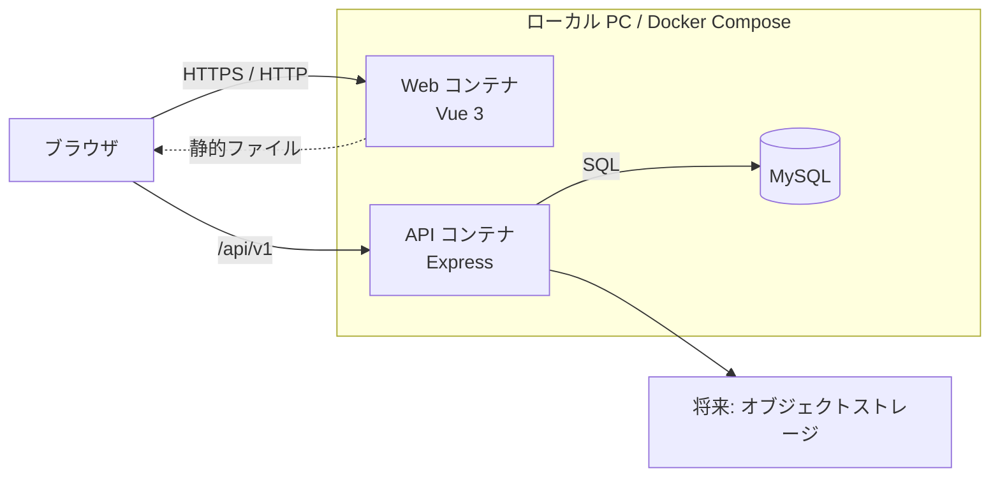
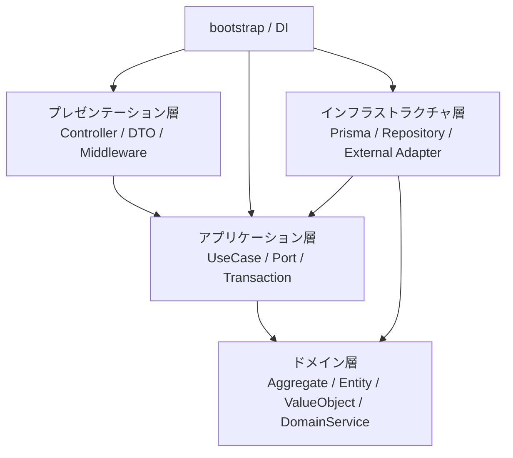

# 全体アーキテクチャ

## 技術スタック

| 領域           | 採用候補                     | 方針                                                                                             |
| -------------- | ---------------------------- | ------------------------------------------------------------------------------------------------ |
| フロントエンド | Vue 3、TypeScript、Vite      | Composition API と Single-File Component を使い、画面状態を型安全に実装する。                    |
| ルーティング   | Vue Router                   | 認証後画面と機能画面のルーティングを定義する。                                                   |
| 状態管理       | Pinia                        | 認証情報など画面をまたぐ状態に限定して利用し、サーバーデータの複製を避ける。                     |
| API            | Node.js、Express、TypeScript | REST API と認証、入力変換を担当する。                                                            |
| DB             | MySQL                        | 業務データ、セッション、監査情報を永続化する。                                                   |
| DB アクセス    | Prisma                       | スキーマ、マイグレーション、型付き DB アクセスに利用し、インフラストラクチャ層だけから参照する。 |
| 入力検証       | Zod                          | HTTP 入力と環境変数を境界で検証する。ドメイン不変条件はドメインモデルでも検証する。              |
| API テスト     | Jest、Supertest              | 既存資産を活かしつつ API とユースケースを検証する。                                              |
| UI テスト      | Vitest、Vue Test Utils       | Vue コンポーネントを利用者の操作と表示結果を中心に検証する。                                     |
| E2E            | Playwright                   | ブラウザから主要業務シナリオを検証する。                                                         |
| ローカル実行   | Docker Compose               | Web、API、MySQL を一括起動する。                                                                 |

ライブラリのバージョンは実装開始時に固定し、Dependabot 等による更新はテスト通過後に取り込む。

## システム構成



ローカルでは Web 開発サーバーまたはリバースプロキシから `/api` を API へ転送し、ブラウザからは同一オリジンとして扱う。EKS では Ingress または Gateway で同じ URL 構造を維持する。

## リポジトリ構成

```text
apps/
  web/
    src/
      app/               # Vue Router、Pinia、画面構成
      features/          # キャリア、目標、日次実績などの機能単位
      shared/            # 共通UI、APIクライアント、汎用処理
  api/
    src/
      presentation/      # HTTP、認証ミドルウェア、DTO、エラー変換
      application/       # ユースケース、ポート、トランザクション境界
      domain/            # 集約、エンティティ、値オブジェクト、ドメインサービス
      infrastructure/    # Prisma、リポジトリ実装、外部サービス、設定
      bootstrap/         # DI構築、Express起動、終了処理
    prisma/
      schema.prisma
      migrations/
packages/
  contracts/             # APIの入出力型。ドメインモデルそのものは公開しない
tests/
  e2e/
```

`apps/api` 内では機能単位のサブディレクトリを併用する。ファイル数が増えた場合も、レイヤー間の依存規則を優先する。

## バックエンド4層



### プレゼンテーション層

- HTTP リクエストを DTO へ変換し、形式を検証する。
- 認証済みユーザー ID をユースケースへ渡す。
- ユースケースの結果を HTTP ステータスとレスポンスへ変換する。
- 業務判断や SQL を書かない。

### アプリケーション層

- 1ユースケースの処理順序とトランザクション境界を定義する。
- リポジトリなど外部依存のインターフェース（ポート）を定義する。
- 所有ユーザーを検索条件に含め、認可漏れを防ぐ。
- ドメインモデルを呼び出すが、HTTP や Prisma の型を参照しない。

### ドメイン層

- 集約、エンティティ、値オブジェクト、不変条件、計算ルールを実装する。
- 達成率、遅延判定、ロードマップ循環禁止などを表現する。
- Express、Prisma、Vue、環境変数へ依存しない。
- 原則として同期的で、純粋な単体テストを高速に実行できる状態にする。

### インフラストラクチャ層

- アプリケーション層で定義したリポジトリを Prisma で実装する。
- MySQL、時刻、ID生成、PDF生成、将来の外部サービスをアダプターとして提供する。
- Prisma のレコードとドメインモデルの相互変換を担当する。
- DB 制約違反などをアプリケーションが扱えるエラーへ変換する。

## 依存関係ルール

| 参照元         | 参照可能                      | 参照禁止                                                  |
| -------------- | ----------------------------- | --------------------------------------------------------- |
| presentation   | application、contracts        | infrastructure の具象、Prisma                             |
| application    | domain、application 内の port | presentation、Prisma、Express                             |
| domain         | domain 内のみ                 | application、presentation、infrastructure、外部ライブラリ |
| infrastructure | application の port、domain   | presentation の controller                                |
| bootstrap      | 全層の組み立て対象            | 業務ロジックの実装                                        |

ESLint の import 制約または依存関係チェックを CI に追加し、ルール違反を自動検出する。

## API 方針

- ベースパスは `/api/v1` とする。
- JSON のプロパティは `camelCase`、DB カラムは `snake_case` とする。
- 一覧 API はページング、絞り込み、安定した並び順を持つ。
- エラーは `code`、`message`、`fieldErrors`、`traceId` を持つ共通形式にする。
- 日時は ISO 8601 UTC、業務上の日付は `YYYY-MM-DD` で受け渡す。
- 更新競合を検出する対象には `version` または `updatedAt` を利用する。

## 認証・認可

- パスワードは Argon2id 等の適切な方式でハッシュ化する。
- ブラウザへは推測困難なセッション ID だけを渡し、認証状態とユーザー情報はサーバー側で管理する。
- セッション ID は `HttpOnly`、`Secure`、`SameSite` を設定した Cookie で扱う。
- セッションは複数 API Pod から参照できる永続ストアへ保存する。
- すべての検索・更新はユーザー ID を条件に含める。存在しない場合と他人所有の場合を外部から区別させない。
- CSRF、レート制限、ログイン試行制限、セキュリティヘッダーをプレゼンテーション層で実施する。

Cookie は認証情報の保存場所そのものではなく、セッション ID をブラウザと API の間で運ぶ手段として利用する。Vue の JavaScript からセッション ID を読み取れないため、XSS が発生した際に認証情報そのものを盗まれる可能性を下げられる。ただし、Cookie はリクエストへ自動送信されるため CSRF 対策が必須になる。

## トランザクション

- 1ユースケースを基本単位とする。
- 複数集約を更新する場合、アプリケーション層が `TransactionManager` ポートを利用する。
- 外部サービス呼び出しを DB トランザクション中に待たない。将来必要になった場合は Outbox パターンを検討する。
