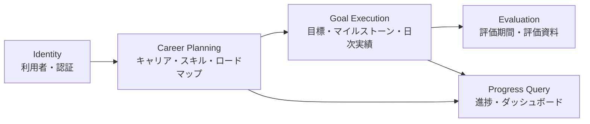

# ドメイン設計

## 境界づけられたコンテキスト

MVP は単一 API と単一 MySQL で実装するモジュラーモノリスとする。境界をコード上で分け、将来必要になった場合にサービス分割できるようにするが、初期段階で分散システムにはしない。

## 集約候補

| コンテキスト    | 集約ルート       | 主な子要素                   | 守る不変条件                                   |
| --------------- | ---------------- | ---------------------------- | ---------------------------------------------- |
| Identity        | User             | SkillLevelDefinition         | メール一意、レベル 1～5                        |
| Career Planning | CareerGoal       | CareerGoalSkill、RoadmapItem | 所有ユーザー一致、期間整合、依存関係の循環禁止 |
| Career Planning | Skill            | -                            | レベル範囲、ユーザー内名称一意                 |
| Goal Execution  | Goal             | Milestone                    | 計算方式別の必須値、正の重み、期限整合         |
| Goal Execution  | DailyRecord      | Evidence                     | 未来日禁止、作業時間範囲、関連目標の所有者一致 |
| Evaluation      | EvaluationPeriod | -                            | 開始日が終了日以前                             |
| Evaluation      | EvaluationReport | EvaluationReportGoal         | 同一期間の下書き管理、生成時点の結果保持       |

集約をまたぐ参照は原則として ID を保持する。巨大なオブジェクトグラフを一度にロードせず、ユースケースに必要な集約だけを取得する。

## 値オブジェクト候補

| 値オブジェクト        | 責務                                                     |
| --------------------- | -------------------------------------------------------- |
| `UserId`、`GoalId` 等 | ID の種類取り違えを防ぐ。                                |
| `EmailAddress`        | 正規化と形式検証を行う。                                 |
| `DateRange`           | 開始・終了日の整合と期間内判定を行う。                   |
| `SkillLevel`          | 1～5 の範囲を保証する。                                  |
| `ProgressRate`        | 0～100 の表示率と超過率を表現する。                      |
| `PositiveWeight`      | 0 より大きい重みを保証する。                             |
| `WorkDuration`        | 0～1,440 分を保証する。                                  |
| `EvidenceUrl`         | http/https URL を保証する。                              |
| `GoalMeasurement`     | 数値、マイルストーン、習慣、手動の方式別入力を表現する。 |

## ドメインサービス

- `GoalProgressCalculator`: 計算方式ごとの達成率と超過率を求める。
- `ScheduleHealthEvaluator`: 予定進捗と実績から順調・注意・遅延・達成を判定する。
- `RoadmapDependencyValidator`: ロードマップ項目の循環参照を検出する。
- `EvaluationReportAssembler`: 評価資料用に成果を分類・集約するためのドメイン情報を構成する。

DB 検索が必要な処理は、アプリケーションサービスが必要情報を集めてからドメインサービスへ渡す。

## ユースケース命名例

- `CreateCareerGoal`
- `LinkSkillToCareerGoal`
- `AddRoadmapItem`
- `CreateGoalFromRoadmapItem`
- `RecordDailyActivity`
- `CalculateGoalProgress`
- `GenerateEvaluationReportDraft`
- `ExportEvaluationReportPdf`

ユースケースは動詞から始め、1つの利用目的を表す。汎用的な `GoalService` に処理を集めない。

## リポジトリ方針

- 集約ルート単位で `GoalRepository` などのポートをアプリケーション層に置く。
- `findById` だけでなく `findOwnedById(userId, goalId)` のように認可条件を型で要求する。
- 画面一覧やダッシュボードは、集約のリポジトリではなく専用 Query Service を利用できる。
- Query Service は読み取りモデルを返し、ドメインエンティティを画面 DTO として流用しない。
